# WiGuard

Wireless sensing based health monitoring system.

## How to run

First, create a `.env` file in the root directory with the following content:

```properties
DATABASE_RUL=
```

Then, build and run the project:

```bash
npm run build
npm start
```

## Workflow

```mermaid
graph LR

ESP32-->NanoMQ
Intel5300-->NanoMQ
NanoMQ-->Cloud
Model[⭐Model]-->Cloud
Cloud-->Web
Cloud-->Client
```



## API

| Path   | Method | Request                | Response | Description |
| ------ | ------ | ---------------------- | -------- | ----------- |
| /login | POST   | `{username, password}` | Token    |             |
