# WiGuard

Wireless sensing based health monitoring system.

## How to run

First, create a `.env` file in the root directory with the following content:

```properties
NUXT_PUBLIC_MQTT_BROKER_URI=
NUXT_SESSION_PASSWORD=password-with-at-least-32-characters
DATABASE_URL=postgres://localhost/wiguard
```

Then, start the development server:

```bash
pnpm run dev
```

## Workflow

```mermaid
graph LR

ESP32-->NanoMQ
Intel5300-->NanoMQ
NanoMQ-->Cloud
Model-->Cloud
Cloud-->Web[⭐Web]
Cloud-->Client
```



## API

| Path   | Method | Request                | Response | Description |
| ------ | ------ | ---------------------- | -------- | ----------- |
| /login | POST   | `{username, password}` | Token    |             |
